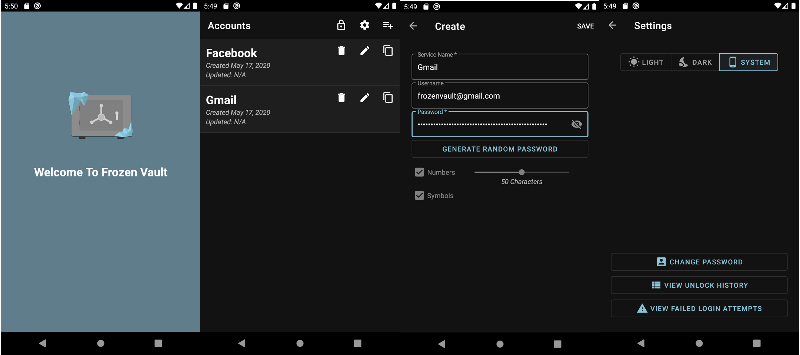

## Screenshots

FrozenVault is a fully free and opensource password manager for Android.
All data is AES encrypted and stored locally on the device so no data will ever leave your device!

## Features
* Store passwords encrypted with AES
* Random password generator
* View password access and update history
* View unlock history (failed and successful attempts)
* Change password
* Session timeout / auto lock
* Dark & Light modes

## Contributing
If you want to contribute checkout the issues to find a good place to start.

Once you've made your change just create a pull request.
Please make your contributions in Kotlin and write unit tests for your changes.
